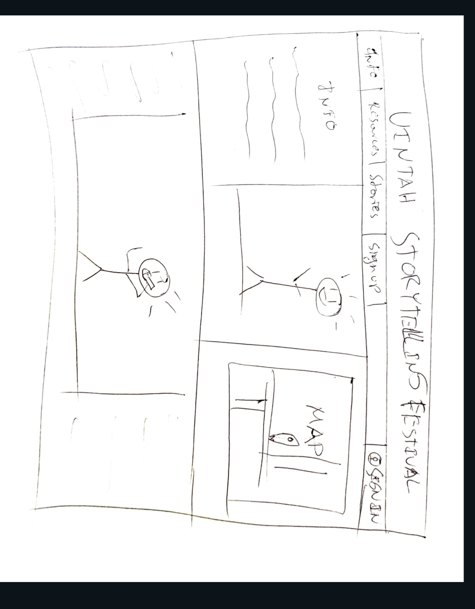

# Uintah Storytelling Festival

[My Notes](notes.md)

The Uintah Storytelling Festival doesn't have a webpage and I'm going to make it for them! It is going to be dynamic, engaging, and informative!

## 🚀 Specification Deliverable

For this deliverable I did the following. I checked the box `[x]` and added a description for things I completed.

- [x] Proper use of Markdown
- [x] A concise and compelling elevator pitch
- [x] Description of key features
- [x] Description of how you will use each technology
- [x] One or more rough sketches of your application. Images must be embedded in this file using Markdown image references.

### Elevator pitch

The Uintah Storytelling festival just broke off from the Uintah School District after having a breakout first year of participation. They need somewhere to gather intrest and participation for upcoming years. What better way to do that than a dedicated website with recordings of previous years and a way to sign up?

### Design

### Key features

- Landing page for all visitors with vital information.
- After scrolling down a widescreen video of a performance automatically plays.
- Keep scrolling to sign up and learn more.
- Catalogue of previous performances.
- Comment sections.
- FAQs.
- Resources for education and where to start.

### Technologies

I am going to use the required technologies in the following ways.

- **HTML** - Uses correct HTML structure, hyperlinks to all relevant information, multiple pages for information, etc.
- **CSS** - Application styling for multiple device types and screen sizes, good coloring and use of blank space.
- **React** - Provides login, comment section area, display videos properly (I don't really know to be honest)
- **Service** - Backend service for login, submitting information.
- **DB/Login** - Stores profile pictures, remembers information and chat histories.
- **WebSocket** - As users submit chats or suggestions, delivers that information to others and the website.

## 🚀 AWS deliverable

For this deliverable I did the following. I checked the box `[x]` and added a description for things I completed.

- [x] **Server deployed and accessible with custom domain name** - [My server link](https://jashubyoung.com.click).

## 🚀 HTML deliverable

For this deliverable I did the following. I checked the box `[x]` and added a description for things I completed.

- [x] **HTML pages** - I created multiple HTML pages that all link to each other.
- [x] **Proper HTML element usage** - I have lots of fun HTML elements!
- [x] **Links** - I have proper links to all pages, and to my github repository.
- [x] **Text** - I put most of the text I need in, though it is pretty rough.
- [x] **3rd party API placeholder** - Technically I have multiple, because of the Youtube videos, but I also have an area for a automatically generated story prompt.
- [x] **Images** - I am using multiple images.
- [x] **Login placeholder** - I have a login place holder that currently does not work.
- [x] **DB data placeholder** - I have a place for users to read through other users' previous chats, along with a place to review their profile.
- [x] **WebSocket placeholder** - I have a chat area that will autimatically update when another user enters information (chats).

## 🚀 CSS deliverable

For this deliverable I did the following. I checked the box `[x]` and added a description for things I completed.

- [ ] **Header, footer, and main content body** - I did not complete this part of the deliverable.
- [ ] **Navigation elements** - I did not complete this part of the deliverable.
- [ ] **Responsive to window resizing** - I did not complete this part of the deliverable.
- [ ] **Application elements** - I did not complete this part of the deliverable.
- [ ] **Application text content** - I did not complete this part of the deliverable.
- [ ] **Application images** - I did not complete this part of the deliverable.

## 🚀 React part 1: Routing deliverable

For this deliverable I did the following. I checked the box `[x]` and added a description for things I completed.

- [ ] **Bundled using Vite** - I did not complete this part of the deliverable.
- [ ] **Components** - I did not complete this part of the deliverable.
- [ ] **Router** - I did not complete this part of the deliverable.

## 🚀 React part 2: Reactivity deliverable

For this deliverable I did the following. I checked the box `[x]` and added a description for things I completed.

- [ ] **All functionality implemented or mocked out** - I did not complete this part of the deliverable.
- [ ] **Hooks** - I did not complete this part of the deliverable.

## 🚀 Service deliverable

For this deliverable I did the following. I checked the box `[x]` and added a description for things I completed.

- [ ] **Node.js/Express HTTP service** - I did not complete this part of the deliverable.
- [ ] **Static middleware for frontend** - I did not complete this part of the deliverable.
- [ ] **Calls to third party endpoints** - I did not complete this part of the deliverable.
- [ ] **Backend service endpoints** - I did not complete this part of the deliverable.
- [ ] **Frontend calls service endpoints** - I did not complete this part of the deliverable.
- [ ] **Supports registration, login, logout, and restricted endpoint** - I did not complete this part of the deliverable.

## 🚀 DB deliverable

For this deliverable I did the following. I checked the box `[x]` and added a description for things I completed.

- [ ] **Stores data in MongoDB** - I did not complete this part of the deliverable.
- [ ] **Stores credentials in MongoDB** - I did not complete this part of the deliverable.

## 🚀 WebSocket deliverable

For this deliverable I did the following. I checked the box `[x]` and added a description for things I completed.

- [ ] **Backend listens for WebSocket connection** - I did not complete this part of the deliverable.
- [ ] **Frontend makes WebSocket connection** - I did not complete this part of the deliverable.
- [ ] **Data sent over WebSocket connection** - I did not complete this part of the deliverable.
- [ ] **WebSocket data displayed** - I did not complete this part of the deliverable.
- [ ] **Application is fully functional** - I did not complete this part of the deliverable.
